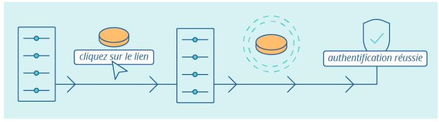

# Installation JWT 

### Rappel doc :

  - doc => https://fr.wikipedia.org/wiki/JSON_Web_Token#:~:text=JSON%20Web%20Token%20(JWT)%20est,l'algorithme%20HMAC%20ou%20RSA.
  - doc => https://symfony.com/bundles/LexikJWTAuthenticationBundle/current/index.html#configure-application-security
  - doc => https://jwt.io/


### A quoi ca sert ?

- L’authentification par jeton est une forme d’authentification qui permet à un utilisateur d’accéder à un service en ligne, une application, ou un site web sans qu’il n’ait à ressaisir ses identifiants. Par conséquent, grâce à cette forme d’authentification, l’utilisateur pourra accéder à ses ressources en ligne, au moyen de ce jeton d’accès, tant qu’il reste valide.
- IL permet l'acces automatisée
- La consultation directe
- 
  
### De quoi est compose le jeton ?

- d'une entete (le header): utilisisé pour décrire le jeton, il s'ajit d'un objet JSON
- du playload : qui represente les informations embarquée dans le jeton, c 'est un objet JSON
- de sa signature : numérique 
- doc=> https://jwt.io/


### Configuration

- Mise en place le bundle Jwt de symfony :

 - php composer require "lexik/jwt-authentication-bundle"
 - php bin/console lexik:jwt:generate-keypair

- Cela nous a creé 2 fichiers Jwt :

    - private.pem
    - public.pem

- Cela nous a generé aussi dans le fichier .env 
  
    ```yaml
        ###> lexik/jwt-authentication-bundle ###
        JWT_SECRET_KEY=%kernel.project_dir%/config/jwt/private.pem
        JWT_PUBLIC_KEY=%kernel.project_dir%/config/jwt/public.pem
        JWT_PASSPHRASE=1de5b2c8724dc17870b4c19b53a7780f8f2a77b3da3b19879bdebc89d92a6f28
        ###< lexik/jwt-authentication-bundle ###
    ```
- Cela nous a generer dans le fichier config/lexik_jwt :

  ```yaml
  - lexik_jwt_authentication:
    secret_key: "%env(resolve:JWT_SECRET_KEY)%"
    public_key: "%env(resolve:JWT_PUBLIC_KEY)%"
    pass_phrase: "%env(JWT_PASSPHRASE)%"
  ```
- il faut mettre en place la configuration dans le fichier `securité.yaml` en suivant la documentation de symfony:

    -doc => (https://symfony.com/bundles/LexikJWTAuthenticationBundle/current/index.html#configure-application-security)

``` php
# config/packages/security.yaml
security:
    enable_authenticator_manager: true
    # ...

    firewalls:
        login:
            pattern: ^/api/login
            stateless: true
            json_login:
                check_path: /api/login_check
                success_handler: lexik_jwt_authentication.handler.authentication_success
                failure_handler: lexik_jwt_authentication.handler.authentication_failure

        api:
            pattern:   ^/api
            stateless: true
            jwt: ~

    access_control:
        - { path: ^/api/login, roles: PUBLIC_ACCESS }
        - { path: ^/api,       roles: IS_AUTHENTICATED_FULLY }
```

- Ne pas oublier de configurer le routage

  - doc => (https://symfony.com/bundles/LexikJWTAuthenticationBundle/current/index.html#configure-application-routing) 


``` yaml
# config/routes.yaml
api_login_check:
    path: /api/login_check
```
### Comment generer le token ?

- Pour generer le token nous devons verifier que notre route /api/login_check en POST exite en faisant un `bin/console debug:route` 
- Ensuite nous devons utiliser insomnia ou thunderClient pour generer le token :
- dans le body d'une des applications, il faut configurer les parametres `username` et `password` pour un user présent dans la BDD.
  
  ```body
  {
   "username" : "login@email.com", 
   "password" :  "password"
  }
  ``` 
### Test

- Verifier que dans le local tout fonctionne 
- Maintenant il ne reste plus qu'a tester avec le côté Front 


  


